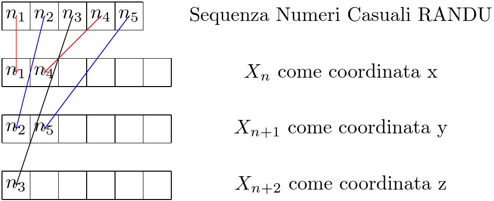

Negli anni ’60, nei laboratori di calcolo scientifico, un piccolo dettaglio algoritmico avrebbe cambiato il modo in cui gli studiosi guardano ai numeri casuali. Quel dettaglio si chiamava **RANDU**, uno dei generatori di numeri pseudocasuali più diffusi… e più problematici della storia.

---
## Che cos’è RANDU?

RANDU è un [generatore lineare congruenziale](https://it.wikipedia.org/wiki/Generatore_lineare_congruenziale), un algoritmo che produce sequenze di numeri apparentemente casuali secondo la formula:

$$X_{n+1} = (a \cdot X_{n} + c) \mod m$$

Nel caso specifico di RANDU, i parametri erano:

- a=65539    
- m= $2^{31}$    
- c= 0

Questo algoritmo era incorporato nei computer IBM e utilizzato in simulazioni [Monte Carlo](https://it.wikipedia.org/wiki/Metodo_Monte_Carlo) in fisica, ingegneria e statistica. Appariva efficiente e “casuale” a prima vista, tanto da guadagnarsi la fiducia di intere generazioni di scienziati.

Ma arriviamo alla ragione dello scandalo, i numeri che generava avevano davvero un comportamento pseudo-casuale?

Effettivamente se proviamo a generare un milione di numeri e facciamo l'istogramma, appare una distribuzione uniforme....

Proviamo a graficare in **3D** i numeri generati da RANDU associandoli a triplette di punti cartesiani come in figura:

Anche se proviamo a graficare i numeri generati da RANDU separandoli in **triple successive di numeri generati**, prendendo: $(X_n,X_{n+1},X_{n+2})$ come $(x,y,z)$ il comportamento potrebbe comunque apparire corretto...

Infatti sembrerebbe ancora essere frutto di una distribuzione uniforme...

Ma attenzione... Ruotando leggermente l'immagine ci viene rivelato il problema: 

>In uno spazio tridimensionale, i punti non si distribuiscono uniformemente come ci si aspetterebbe da una sequenza casuale, ma cadono su **15 piani distinti**.

Questo fenomeno è dovuto a una scelta inadeguata dei parametri: la sequenza sembra casuale guardata singolarmente, ma le correlazioni tra numeri consecutivi introducono pattern regolari.

Il difetto di RANDU ha avuto effetti concreti: simulazioni Monte Carlo che si basavano su di esso potevano fornire risultati **distorti e falsamente coerenti**. In altre parole, la scienza stava interpretando come casuale ciò che in realtà era strutturato e prevedibile.

Questo non è solo un curioso aneddoto storico. È diventato un **caso di studio classico** sull’importanza di verificare la qualità dei generatori di numeri pseudocasuali prima di usarli in applicazioni critiche. Anche oggi, quando si progettano algoritmi per simulazioni, crittografia o intelligenza artificiale, il principio rimane lo stesso: un numero casuale mal progettato può compromettere interi esperimenti.
