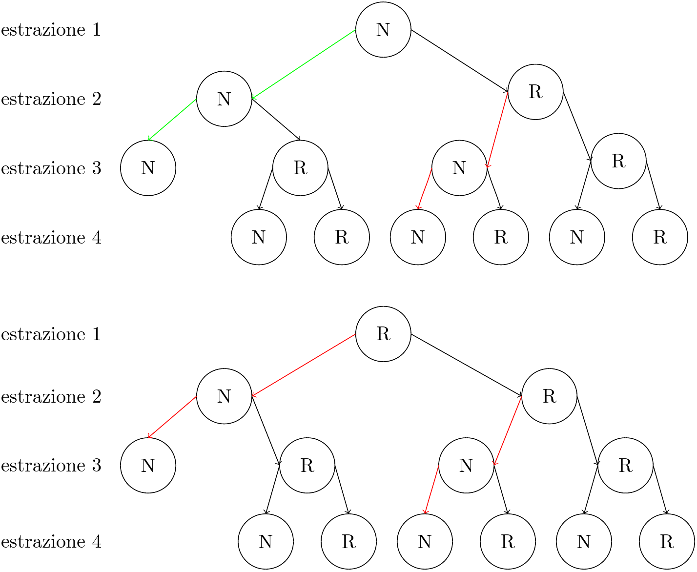

Immaginate un gioco per due giocatori basato su un mazzo standard di 52 carte, in cui ci interessa esclusivamente il **colore** delle carte: rosso (R) o nero (N).

All’inizio del gioco, ogni giocatore sceglie una **sequenza di tre colori** che osserverà per tutto il resto della partita. Ad esempio, il **Giocatore 1** potrebbe scegliere la sequenza **R-N-N**, mentre il **Giocatore 2** potrebbe optare per **R-R-N**.

Il gioco procede quindi così: si pescano le carte una alla volta dal mazzo. Ogni volta che compare una sequenza corrispondente a quella di un giocatore, quel giocatore segna un punto e le carte vengono scartate. Si continua fino all’esaurimento del mazzo.

A prima vista, il gioco sembra equo, ma esiste una **strategia vincente per il secondo giocatore**. La regola è semplice:

- Il Giocatore 2 osserva la sequenza scelta dal Giocatore 1, ad esempio **R-N-R**.
    
- Compone la propria sequenza seguendo questo schema:
    
    1. Il primo colore sarà l’inverso del colore centrale della sequenza avversaria (qui, R).
        
    2. Il secondo colore sarà uguale al primo della sequenza avversaria (qui, R).
        
    3. Il terzo colore sarà uguale al secondo della sequenza avversaria (qui, N).
        

Applicando questa strategia, il Giocatore 2 aumenta le proprie possibilità di vincere. La domanda naturale è:

>**Qual è la probabilità che il Giocatore 2 vinca applicando questa strategia rispetto al Giocatore 1?**

<details>
<summary>Clicca qui per la soluzione</summary>

Il gioco descritto è un esempio classico noto come [**Penney's Game**](https://en.wikipedia.org/wiki/Penney's_game). Si tratta di un gioco apparentemente equo, ma che in realtà favorisce nettamente il secondo giocatore.

Per i più curiosi:
Il gioco può essere schematizzato come una **[catena di Markov](https://it.wikipedia.org/wiki/Processo_markoviano) assorbente non omogenea**, in cui:

- Gli **stati** rappresentano le sequenze parziali già osservate.
    
- Gli **stati assorbenti** corrispondono al completamento di una sequenza vincente.

Esiste anche una spiegazione **grafica e intuitiva** di questo risultato. Consideriamo, ad esempio, la scelta del **giocatore 1** NNN e quella del **giocatore 2** RNN, limitando l’analisi alle prime quattro estrazioni.

Osservando l’immagine sottostante, si nota che il giocatore 1 ha una possibilità concreta di vittoria **solo entro le prime 3 estrazioni**, evento rappresentato dal collegamento in $\color{green}{verde}$. 
Questo è l’unico percorso che può portare alla comparsa della sua sequenza prima di quella dell’avversario.

In tutti gli altri casi, l’evoluzione del gioco conduce rapidamente verso stati che favoriscono il **giocatore 2**, evidenziati dai collegamenti in $\color{red}{rosso}$. La struttura delle transizioni rende quindi il suo vantaggio sistematico, e non il risultato di una coincidenza.


### Probabilità di vittoria per ciascuna combinazione di sequenze

|Scelta del 1° giocatore|Scelta del 2° giocatore|Probabilità vittoria 1° giocatore|Probabilità vittoria 2° giocatore|Probabilità pareggio|
|---|---|---|---|---|
|NNN|NNN|0,11%|99,49%|0,40%|
|NNR|RNN|2,62%|93,54%|3,84%|
|NRN|NNR|11,61%|80,11%|8,28%|
|NRR|NNR|5,18%|88,29%|6,53%|
|RNN|RRN|5,18%|88,29%|6,53%|
|RNR|RRN|11,61%|80,11%|8,28%|
|RRN|NRR|2,62%|93,54%|3,84%|
|RRR|NRR|0,11%|99,49%|0,40%|

> Nota: N = nero, R = rosso

---
Effettuando 1 milione di simulazioni dove il giocatore-1 seleziona casualmente ogni volta la sua combinazione e il giocatore-2 implementa la sua strategia si ottiene il seguente risultato:

Probabilità vittoria 1° giocatore|Media Punti 1° giocatore|Probabilità vittoria 2° giocatore| Media Punti 2° giocatore|Probabilità pareggio|
|---|---|---|---|---|
|4,88%|2,23±1,56|90,38%|6,09±1,39|0,40%|
---


Per completezza, allego di seguito il codice Python impiegato per la simulazione Monte Carlo dei risultati, dove si sono utilizzati 0 e 1 invece di N e R.

```python
import random
from random import randint as rng
import math

simulazioni = 1_000_000   
l_meta_mazzo = 26         #metà della lunghezza del mazzo
player1_scores = []
player2_scores = []

for _ in range(simulazioni):
    
    player1 = [rng(0,1),rng(0,1),rng(0,1)]
    player2 = [0 if player1[1] == 1 else 1, player1[0], player1[1]]

    mazzo = [1] * l_meta_mazzo + [0] * l_meta_mazzo
    random.shuffle(mazzo)

    player1_points = 0
    player2_points = 0

    i = 0
    while i <= len(mazzo)-3:
        window = mazzo[i:i+3]
        if window == player1:
            player1_points += 1
            i += 3
        elif window == player2:
            player2_points += 1
            i += 3
        else:
            i += 1  

    
    player1_scores.append(player1_points)
    player2_scores.append(player2_points)

# Calcolo percentuale di vittoria e media punti
player1_wins = sum(1 for p1, p2 in zip(player1_scores, player2_scores) if p1 > p2)
player2_wins = sum(1 for p1, p2 in zip(player1_scores, player2_scores) if p2 > p1)
pareggi = simulazioni - player1_wins - player2_wins

media_player1 = sum(player1_scores) / simulazioni
media_player2 = sum(player2_scores) / simulazioni
dev_std_player1 = math.sqrt(sum((x - media_player1) ** 2 for x in player1_scores) / simulazioni)
dev_std_player2 = math.sqrt(sum((x - media_player2) ** 2 for x in player2_scores) / simulazioni)

print(f"Player1 vince: {player1_wins / simulazioni * 100:.2f}%")
print(f"Player2 vince: {player2_wins / simulazioni * 100:.2f}%")
print(f"Pareggi: {pareggi / simulazioni * 100:.2f}%")
print(f"Media punti Player1: {media_player1:.2f}, Dev Std: {dev_std_player1:.2f}")
print(f"Media punti Player2: {media_player2:.2f}, Dev Std: {dev_std_player2:.2f}")
print(f"mazzo di {len(mazzo)} carte")


```

</details>